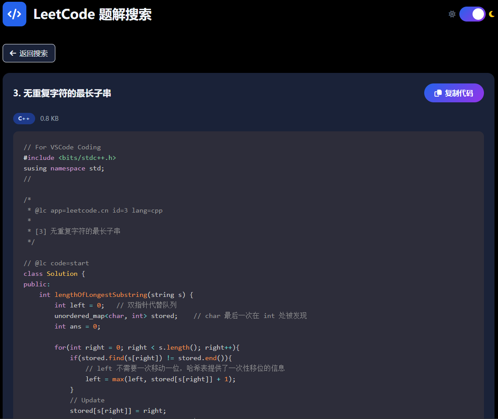

# LeetCode Reviewer

**为基于 VSCode-LeetCode 插件的本地刷题工作流添加自动化代码管理和在线搜索查看功能。通过 GitHub Actions + GitHub Pages，将本地题解转换为可搜索的在线代码库**

---

大致原理：

将代码文件存放于 codes 文件夹（遵循 LeetCode 插件自动生成的文件名）

Github Actions 会在每次仓库更新时更新代码清单（`index.json`）

Github Pages 根据 `index.json` 的内容生成一个静态页面，可以根据关键词搜索查看某一题的代码文件

​	（仓库里有一个 *基于 AI 生成的* `index.html` 可供直接使用，也可以自己基于 `index.json` 的内容自己编写前端页面；该 `index.html` 使用 `prism.js` 作为语法高亮库，只引用了常用的代码语言对应的库，可自行进行增删）

---

如何使用？

1. Fork 这个仓库，并且在本地同步一份

    （可能需要删除原仓库的一些内容，比如这个README文件和 `images` 文件夹）

2. 使用 VSCode-LeetCode 插件进行做题，将题解文件保存至本地仓库的 `codes` 文件夹

    （每次向 Github 推送更改时，`index.json` 会进行同步更新）

3. 为仓库配置 Github Pages 

---

效果图：

**欢迎 Fork 使用 ❤**
