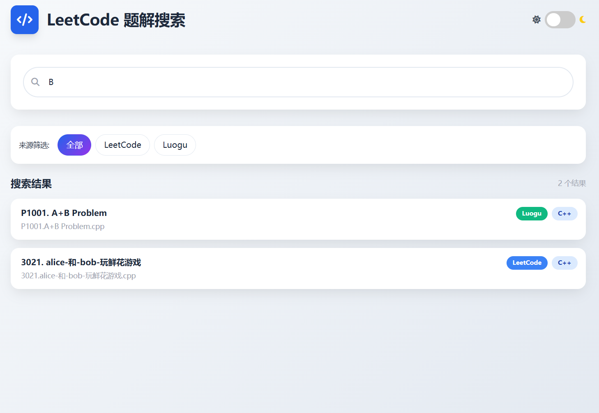
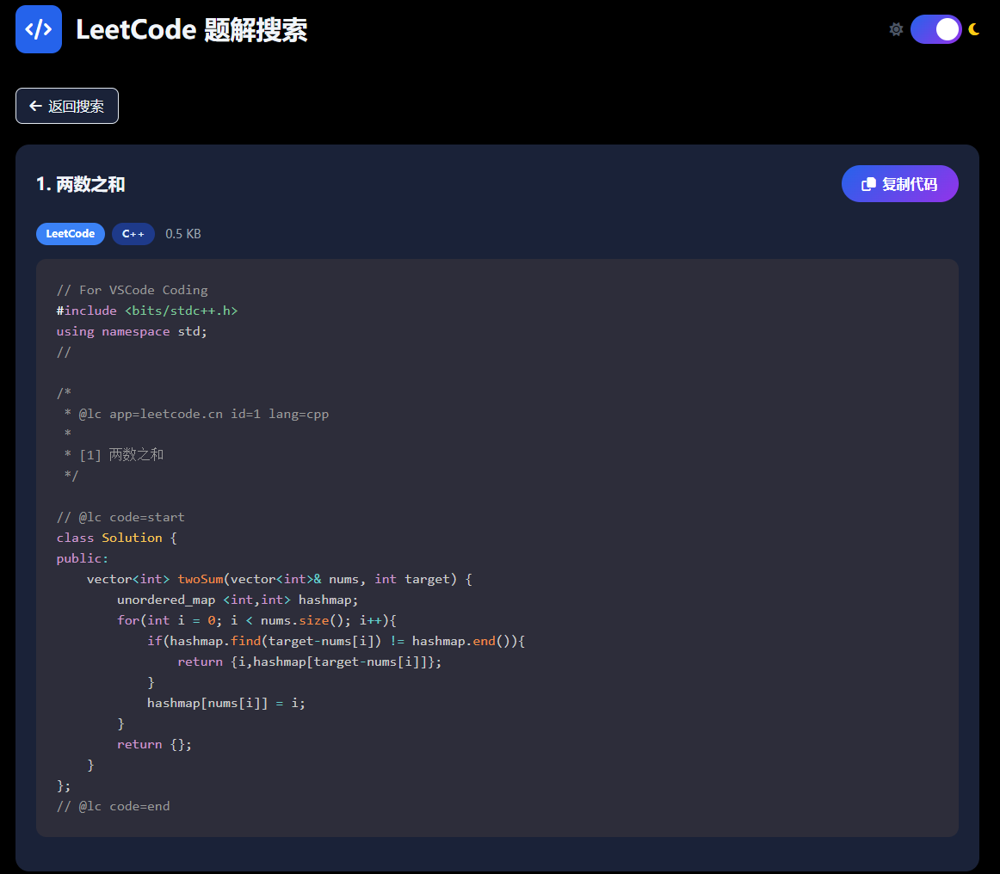
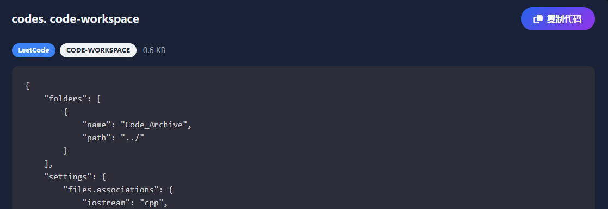

# LeetCode Reviewer

**为基于 VSCode-LeetCode 插件的本地刷题工作流添加自动化代码管理和在线搜索查看功能。通过 GitHub Actions + GitHub Pages，将本地题解转换为可搜索的在线代码库** 

> **Update：**
>
> **添加了一个 Luogu_added 分支，该分支会根据 codes 的文件名开头是否包含 P （表示 Luogu 主题库的题号）区分题目来源，同时前端 HTML 页面也可以进行相应的筛选（main 分支没有变动，考虑到项目本质依旧是 LeetCode 的 Reviewer）**
>
> 如果只是 LeetCode 侧刷题的话，选择 main 分支即可；如果是 L² 双修，选择 Luogu_added 分支，并确保 Luogu 侧的题解文件都是 P 字母开头的，这样才会正确识别题目来源
>
> （如果是 Luogu 侧的非 Luogu 主题库的题目的话（不是 P 开头题号），会被分类到 LeetCode 题目）

---

**工作流：**

代码文件存放于 codes 文件夹（遵循 LeetCode 插件自动生成的文件名）

​	（这个仓库的 `codes` 文件夹存放了两个测试文件，便于生成正确的 `index.json`）

Github Actions 会在每次仓库更新时更新代码清单（`index.json`）

Github Pages 根据 `index.json` 的内容生成一个静态页面，可以根据关键词搜索查看某一题的代码文件

​	（仓库里有一个 *基于 AI 生成的* `index.html` 可供直接使用，也可以自己基于 `index.json` 的内容自己编写前端页面；该 `index.html` 使用 `prism.js` 作为语法高亮库，只引用了常用的代码语言对应的库，可自行进行增删）

---

**如何使用？**

1. Fork 这个仓库，并且在本地同步一份

    （只需要删除这个README文件和 `images` 文件夹，并且清空 `codes` 文件夹放入新的代码文件即可）

2. 使用 VSCode-LeetCode 插件进行做题，将题解文件保存至本地仓库的 `codes` 文件夹

    （每次向 Github 推送更改时，`index.json` 会根据 `codes` 文件夹进行同步更新）

3. 记得为仓库配置 Github Pages 

---

效果图：

（可以切换 Hikari Side （浅色模式）和 Tairitsu Side（深色模式））

你可以访问我的 [刷题小仓库](https://code.nopthon.icu/) 看看效果

（本人使用的是同时包含 LeetCode 与 Luogu 两个刷题平台的分支版）

**欢迎 Fork 使用 ❤**

---

> Bugs：
>
> 代码显示框的右上角始终识别文本为 Plain Text
>
> 类似 codes.code-workspace 的无关文件也会因为格式匹配而列入搜索范围，虽然也能正常显示吧（ LeetCode 是什么鬼）
>
> 
